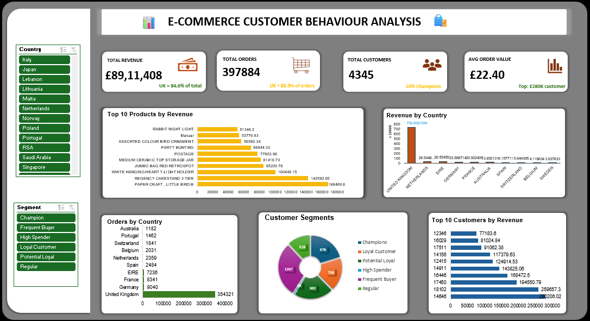

# Ecommerce-Customer-Behaviour-analysis
# E-Commerce Customer Behaviour Analysis Dashboard (Excel)

## 📌 Project Overview
This project is an interactive Excel dashboard developed to analyze customer purchasing behavior in an e-commerce business environment.

The dashboard provides insights into:
- Customer purchasing patterns
- Revenue performance
- Country-wise sales contribution
- Top-performing products
- Customer segmentation
- Order distribution analysis

The primary goal of this project is to support business decision-making through data visualization and analytical reporting using Microsoft Excel.

---

# 🛠 Tools & Technologies Used
- Microsoft Excel
- Pivot Tables
- Pivot Charts
- Slicers
- Conditional Formatting
- Data Cleaning & Transformation
- Excel Formulas

---

# 📊 Dashboard Features

## 🔹 KPI Cards
The dashboard tracks important business metrics:
- Total Revenue
- Total Orders
- Total Customers
- Average Order Value

---

## 🔹 Revenue Analysis
- Revenue by Country
- Top 10 Products by Revenue
- Top 10 Customers by Revenue

---

## 🔹 Customer Behaviour Analysis
Customer segmentation categories include:
- Champions
- Loyal Customers
- High Spenders
- Frequent Buyers
- Potential Loyalists
- Regular Customers

---

## 🔹 Order Analysis
- Orders by Country
- Country-wise sales performance
- Revenue contribution analysis

---

# 📈 Key Insights
- United Kingdom generated the highest revenue contribution.
- A small group of customers contributed significantly to overall revenue.
- Certain products consistently dominated sales performance.
- Loyal and champion customers formed the major customer base.
- Revenue contribution varied significantly across countries.

---

# 🧠 Skills Demonstrated
- Dashboard Design in Excel
- Pivot Table Analysis
- Interactive Slicers
- KPI Development
- Customer Segmentation
- Data Visualization
- Business Storytelling
- Analytical Reporting

---

# 📷 Dashboard Preview

---

# 🚀 Business Value
This dashboard helps businesses:
- Identify high-value customers
- Understand purchasing behavior
- Monitor regional sales performance
- Improve customer retention strategies
- Track product-level performance

---
